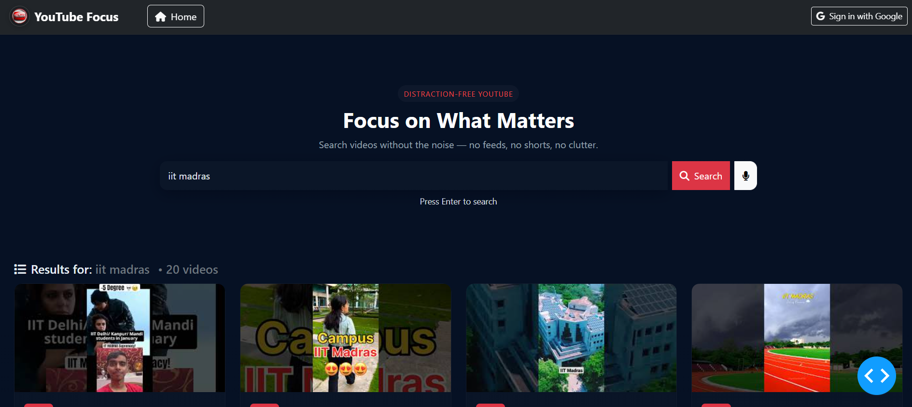

# YouTube Focus Clone 🎥

A distraction-free YouTube interface with only search functionality, built with Python and Dash.


## Features ✨
- Clean search-only interface (no recommendations/shorts)
- Google authentication via Firebase
- Voice search capability
- SQLite database for user preferences
- Responsive design with Dash Bootstrap Components

## Technologies Used 🛠️
- Python 3.10+
- Dash (for web framework)
- Dash Bootstrap Components (for UI)
- Firebase (for authentication)
- YouTube Data API v3
- SQLite (for local storage)

## Setup Instructions 🚀

### Prerequisites
- Python 3.10 or later
- Google Cloud account (for YouTube API)
- Firebase project

### Installation
1. Clone the repository:
   ```bash
   git clone https://github.com/your-username/youtube-focus-clone.git
   cd youtube-focus-clone
   
2. Follow these steps to set up the env file i.e the API Credentials:
   - Create a new project in the Google Cloud Console.
   - Go to the Credentials page.
   - Click the Create credentials button and select API key.
   - Click the Create button.
   - Copy the API key and paste it in the env file.
   - Create a new project in the Firebase Console.
   - Go to the Project Overview page.
   - Click the Add Firebase to your web app button.
   - Copy the config object and paste it in the env file.